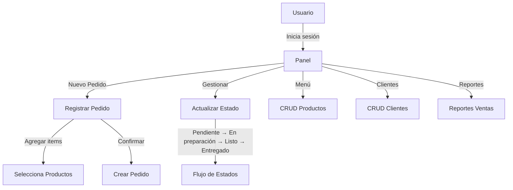
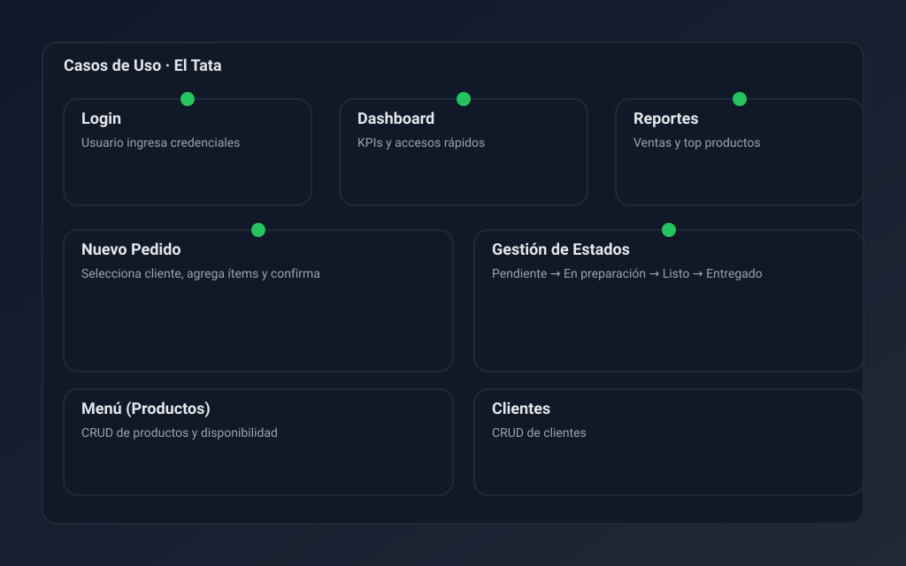
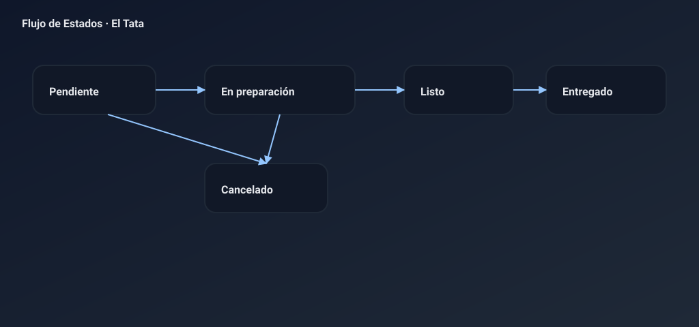
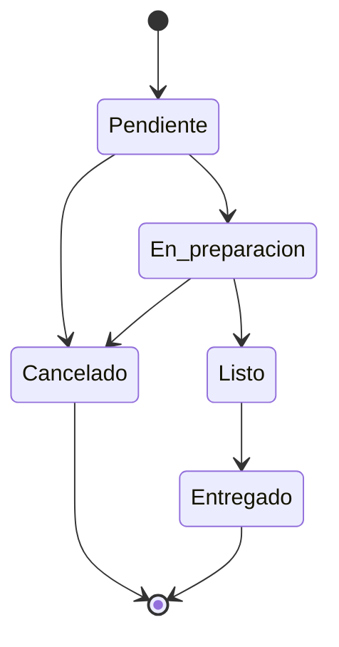

# Sistema de Gestión de Pedidos "El Tata" — SRS (IEEE 830)

## Resumen
- API REST funcionando para gestión de pedidos, productos y clientes.
- Basado en los requisitos del SRS según IEEE 830, con mejoras propuestas.
- Documentación, rutas para Postman, y diagramas de flujo y casos de uso.

## Endpoints y Exploración
- Base: `http://localhost:8000`
- Documentación interactiva: `http://localhost:8000/docs`
- Colección Postman: `postman/ElTata.postman_collection.json`

## Requisitos Funcionales (RF)
- RF-01 Registro de pedidos (cliente, productos, cantidades, observaciones, fecha/hora)
- RF-02 Gestión de estados del pedido (Pendiente → En preparación → Listo → Entregado/Cancelado)
- RF-03 Modificación de pedidos (solo en Pendiente/En preparación)
- RF-04 Gestión de productos (CRUD completo)
- RF-05 Cálculo automático (subtotal, impuestos, descuentos, total)
- RF-06 Gestión de clientes (registro y consulta)
- RF-07 Reportes de ventas (por período, top productos, ingresos, promedio ticket)
- RF-08 Notificaciones (pendiente de implementación)

## Requisitos No Funcionales (RNF)
- Usabilidad: interfaz de API con Swagger; futuras UI responsive.
- Rendimiento: respuesta típica < 3s en operaciones comunes.
- Seguridad: pendiente autenticación; HTTPS recomendado en despliegue.
- Disponibilidad: objetivo ≥98%; backups diarios recomendados.
- Escalabilidad: crecimiento a cientos de productos y pedidos diarios.
- Compatibilidad: navegadores modernos; API estándar HTTP/JSON.
- Backup: recomendación de backup automático diario.

## Interfaces del Sistema
- Usuario: roles Admin/Empleado (autenticación futura); paneles y formularios.
- Hardware: tablets y PCs; impresora de tickets.
- Comunicación: API REST; protocolo HTTPS recomendado.

## Modelo de Datos (simplificado)
- `customers(id, name, phone, address)`
- `products(id, name, description, price, category, available)`
- `orders(id, customer_id, status, created_at, notes)`
- `order_items(id, order_id, product_id, quantity, unit_price)`

## Casos de Uso (Mermaid)


## Imágenes Modernas
- Casos de uso (SVG): 
- Flujo de estados (SVG): 

## Diagrama de Flujo de Estados


## API (Resumen de Rutas)
- `GET /health`
- `GET /productos` | `GET /productos/{id}` | `POST /productos` | `PUT /productos/{id}` | `DELETE /productos/{id}`
- `GET /clientes` | `GET /clientes/{id}` | `POST /clientes` | `PUT /clientes/{id}` | `DELETE /clientes/{id}`
- `GET /pedidos?status=` | `GET /pedidos/{id}` (detalle con totales) | `POST /pedidos` (items) | `PUT /pedidos/{id}` (notas) | `POST /pedidos/{id}/estado` | `DELETE /pedidos/{id}`
- `GET /reportes/ventas?desde=&hasta=`
- `POST /auth/login` (autenticación básica; usuario seed `admin`/`admin`)
- `GET /pedidos/{id}/ticket` (ticket imprimible)

## Formatos de Datos
- Fechas: ISO 8601 (`YYYY-MM-DDTHH:MM:SSZ`)
- Moneda: decimal (`price`, `unit_price`) en ARS.
- Estado: uno de `[Pendiente, En preparación, Listo, Entregado, Cancelado]`.

## Criterios de Aceptación
- Procesar 50 pedidos/hora sin degradación notable.
- Operaciones comunes < 3s de respuesta.
- Reportes generados en < 60s.
- Backup/restore de BD en < 30 min.

## Métricas de Calidad
- Cobertura de pruebas objetivo > 80% (pendiente de tests).
- Tiempo promedio de respuesta objetivo < 2s.
- Satisfacción de usuario > 4/5.

## Diagramas de Interfaz (Wireframes)

### Login
```
┌─────────────────────────────────────┐
│           EL TATA - LOGIN           │
├─────────────────────────────────────┤
│  Usuario: [ admin ]                 │
│  Contraseña: [  ••••••••• ]         │
│  [ ] Recordar usuario               │
│  [ INGRESAR ]                       │
└─────────────────────────────────────┘
```

### Dashboard
```
┌─────────────────────────────────────────────────────┐
│ EL TATA › Dashboard       [👤 Admin] [⚙] [🚪]       │
├─────────────────────────────────────────────────────┤
│  KPIs, pedidos recientes, accesos rápidos           │
│  [ NUEVO PEDIDO ]  [ MENÚ ]  [ REPORTES ]           │
└─────────────────────────────────────────────────────┘
```

### Nuevo Pedido
```
┌─────────────────────────────────────────────────────┐
│ CLIENTE, TELÉFONO, PRODUCTOS, ÍTEMS, TOTALES        │
│ [➕ Agregar] [ Cantidad ] [ CONFIRMAR PEDIDO ]       │
└─────────────────────────────────────────────────────┘
```

### Gestión de Estados
```
Pendientes | En preparación | Listos (Arrastrar/Acciones)  
[ ACTUALIZAR ]   [ NUEVO PEDIDO ]
```

### Gestión de Menú
```
Listado con filtros, edición y disponibilidad ✅/❌
```

### Reportes
```
Período, KPIs, top productos, gráficos, exportación PDF
```

## Despliegue y Configuración
- Base de datos: `ELTATA_DB_PATH` opcional para definir ruta del `.db`.
- Desarrollo: ejecutar servidor en `uvicorn app.main:app --reload`.
- CORS: habilitado para `*` en desarrollo; ajustar en producción.

## Autenticación
- Endpoint: `POST /auth/login` con `username` y `password`.
- Respuesta: `token`, `username`, `role`.
- Seed: usuario `admin` contraseña `admin`.
- Uso en frontend: guarda token y muestra badge de usuario.

## Reportes diarios
- Pestaña “Reportes” en frontend.
- KPIs: Total de ventas, pedidos, promedio ticket.
- Filtro por fecha “Desde/Hasta” o botón “Hoy”.

## Glosario
- Pedido: solicitud de productos de un cliente.
- Ítem de pedido: producto y cantidad asociada a un pedido.
- Estado: fase del ciclo de vida del pedido.
- Cliente: persona que realiza el pedido.
- Producto: bien ofrecido (pizza, bebida, etc.).

## Recomendaciones Futuras
- Autenticación y roles.
- Notificaciones (SMS/email) en cambio de estado.
- Exportación de reportes a PDF.
- UI admin y POS (tablet) con los wireframes anteriores.