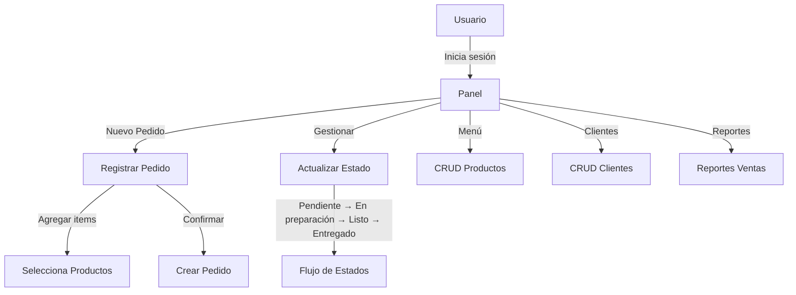
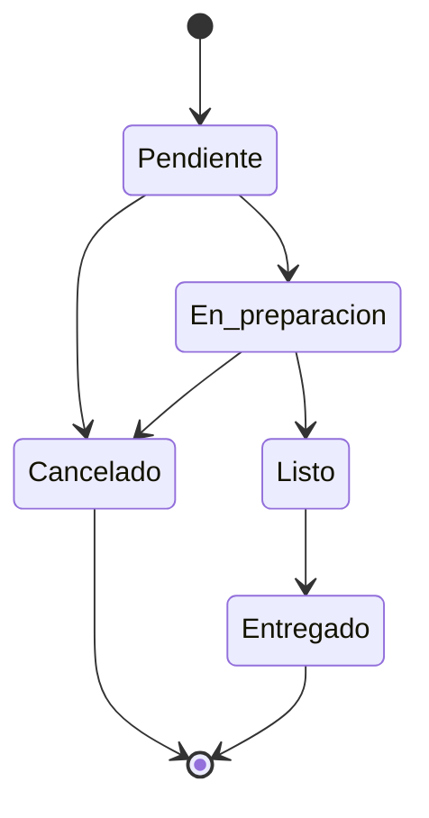

# Sistema de Gestión de Pedidos "El Tata" — SRS (IEEE 830)

## Resumen
- API REST funcionando para gestión de pedidos, productos y clientes.
- Basado en los requisitos del SRS según IEEE 830, con mejoras propuestas.
- Documentación, rutas para Postman, y diagramas de flujo y casos de uso.

## Endpoints y Exploración
- Base: `http://localhost:8000`
- Documentación interactiva: `http://localhost:8000/docs`
- Colección Postman: `postman/ElTata.postman_collection.json`

## Requisitos Funcionales (RF)
- RF-01 Registro de pedidos (cliente, productos, cantidades, observaciones, fecha/hora)
- RF-02 Gestión de estados del pedido (Pendiente → En preparación → Listo → Entregado/Cancelado)
- RF-03 Modificación de pedidos (solo en Pendiente/En preparación)
- RF-04 Gestión de productos (CRUD completo)
- RF-05 Cálculo automático (subtotal, impuestos, descuentos, total)
- RF-06 Gestión de clientes (registro y consulta)
- RF-07 Reportes de ventas (por período, top productos, ingresos, promedio ticket)
- RF-08 Notificaciones (pendiente de implementación)

## Requisitos No Funcionales (RNF)
- Usabilidad: interfaz de API con Swagger; futuras UI responsive.
- Rendimiento: respuesta típica < 3s en operaciones comunes.
- Seguridad: pendiente autenticación; HTTPS recomendado en despliegue.
- Disponibilidad: objetivo ≥98%; backups diarios recomendados.
- Escalabilidad: crecimiento a cientos de productos y pedidos diarios.
- Compatibilidad: navegadores modernos; API estándar HTTP/JSON.
- Backup: recomendación de backup automático diario.

## Interfaces del Sistema
- Usuario: roles Admin/Empleado (autenticación futura); paneles y formularios.
- Hardware: tablets y PCs; impresora de tickets.
- Comunicación: API REST; protocolo HTTPS recomendado.

## Modelo de Datos (simplificado)
- `customers(id, name, phone, address)`
- `products(id, name, description, price, category, available)`
- `orders(id, customer_id, status, created_at, notes)`
- `order_items(id, order_id, product_id, quantity, unit_price)`

## Casos de Uso (Mermaid)


## Imágenes Modernas
- Casos de uso (SVG): 
- Flujo de estados (SVG): 

## Diagrama de Flujo de Estados


## API (Resumen de Rutas)
- `GET /health`
- `GET /productos` | `GET /productos/{id}` | `POST /productos` | `PUT /productos/{id}` | `DELETE /productos/{id}`
- `GET /clientes` | `GET /clientes/{id}` | `POST /clientes` | `PUT /clientes/{id}` | `DELETE /clientes/{id}`
- `GET /pedidos?status=` | `GET /pedidos/{id}` (detalle con totales) | `POST /pedidos` (items) | `PUT /pedidos/{id}` (notas) | `POST /pedidos/{id}/estado` | `DELETE /pedidos/{id}`
- `GET /reportes/ventas?desde=&hasta=`
- `POST /auth/login` (autenticación básica; usuario seed `admin`/`admin`)
- `POST /auth/register` (alta de usuario)
- `POST /auth/logout` (cierre de sesión)
- `GET /auth/me` (validación del token y rol)
- `GET /pedidos/{id}/ticket` (ticket imprimible)

## Formatos de Datos
- Fechas: ISO 8601 (`YYYY-MM-DDTHH:MM:SSZ`)
- Moneda: decimal (`price`, `unit_price`) en ARS.
- Estado: uno de `[Pendiente, En preparación, Listo, Entregado, Cancelado]`.

## Criterios de Aceptación
- Procesar 50 pedidos/hora sin degradación notable.
- Operaciones comunes < 3s de respuesta.
- Reportes generados en < 60s.
- Backup/restore de BD en < 30 min.

## Métricas de Calidad
- Cobertura de pruebas objetivo > 80% (pendiente de tests).
- Tiempo promedio de respuesta objetivo < 2s.
- Satisfacción de usuario > 4/5.

## Diagramas de Interfaz (Wireframes)

### Login
```
┌─────────────────────────────────────┐
│           EL TATA - LOGIN           │
├─────────────────────────────────────┤
│  Usuario: [ admin ]                 │
│  Contraseña: [  ••••••••• ]         │
│  [ ] Recordar usuario               │
│  [ INGRESAR ]                       │
└─────────────────────────────────────┘
```

### Dashboard
```
┌─────────────────────────────────────────────────────┐
│ EL TATA › Dashboard       [👤 Admin] [⚙] [🚪]       │
├─────────────────────────────────────────────────────┤
│  KPIs, pedidos recientes, accesos rápidos           │
│  [ NUEVO PEDIDO ]  [ MENÚ ]  [ REPORTES ]           │
└─────────────────────────────────────────────────────┘
```

### Nuevo Pedido
```
┌─────────────────────────────────────────────────────┐
│ CLIENTE, TELÉFONO, PRODUCTOS, ÍTEMS, TOTALES        │
│ [➕ Agregar] [ Cantidad ] [ CONFIRMAR PEDIDO ]       │
└─────────────────────────────────────────────────────┘
```

### Gestión de Estados
```
Pendientes | En preparación | Listos (Arrastrar/Acciones)  
[ ACTUALIZAR ]   [ NUEVO PEDIDO ]
```

### Gestión de Menú
```
Listado con filtros, edición y disponibilidad ✅/❌
```

### Reportes
```
Período, KPIs, top productos, gráficos, exportación PDF
```

## Despliegue y Configuración
- Base de datos: `ELTATA_DB_PATH` opcional para definir ruta del `.db`.
- Desarrollo: ejecutar servidor en `uvicorn app.main:app --reload`.
- CORS: habilitado para `*` en desarrollo; ajustar en producción.

## Autenticación
- Endpoint: `POST /auth/login` con `username` y `password`.
- Respuesta: `token`, `username`, `role`.
- Seed: usuario `admin` contraseña `admin`.
- Uso en frontend: guarda token y muestra badge de usuario.
- Registro: `POST /auth/register` devuelve token y rol inicial.
- Logout: `POST /auth/logout` invalida el token actual.
- Validación: `GET /auth/me` mantiene sesión y controla navegación.

## Reportes diarios
- Pestaña “Reportes” en frontend.
- KPIs: Total de ventas, pedidos, promedio ticket.
- Filtro por fecha “Desde/Hasta” o botón “Hoy”.

## Glosario
- Pedido: solicitud de productos de un cliente.
- Ítem de pedido: producto y cantidad asociada a un pedido.
- Estado: fase del ciclo de vida del pedido.
- Cliente: persona que realiza el pedido.
- Producto: bien ofrecido (pizza, bebida, etc.).

## Recomendaciones Futuras
- Autenticación y roles.
- Notificaciones (SMS/email) en cambio de estado.
- Exportación de reportes a PDF.
- UI admin y POS (tablet) con los wireframes anteriores.
## ESPECIFICACIÓN DE REQUISITOS DEL SOFTWARE (SRS) — SISTEMA "EL TATA"

### Diagramas de Casos de Uso

Diagrama General (visual)

```
┌─────────────────────────────────────────────────────────────┐
│                    SISTEMA GESTIÓN PEDIDOS                  │
└─────────────────────────────────────────────────────────────┘
            ▲                          ▲                  ▲
            │                          │                  │
    ┌───────┼──────────────────────────┼──────────────────┼───────┐
    │       │                          │                  │       │
    ▼       ▼                          ▼                  ▼       ▼

[Administrador]                 [Empleado]              [Cliente]
    👨‍💼                         👨‍🍳                     👤
    │                            │                        │
    ├─ Gestionar Menú            ├─ Registrar Pedido      ├─ Recibir Notificación
    ├─ Generar Reportes          ├─ Modificar Pedido      └─ Consultar Estado
    └─ Administrar Usuarios      └─ Cancelar Pedido
```

Actores y Casos de Uso (detallado)

```
┌─────────────────────────────────────────┐
│             ADMINISTRADOR               │
├─────────────────────────────────────────┤
│ • Gestionar Menú Principal              │
│ • Generar Reportes de Ventas            │
│ • Administrar Usuarios del Sistema      │
│ • Configurar Parámetros del Sistema     │
└─────────────────────────────────────────┘

📝 GESTIONAR MENÚ
├── Agregar nuevo producto
├── Modificar producto existente
├── Eliminar producto
├── Actualizar precios
└── Categorizar productos

┌─────────────────────────────────────────┐
│               EMPLEADO                  │
├─────────────────────────────────────────┤
│ • Registrar Nuevos Pedidos              │
│ • Modificar Pedidos Existentes          │
│ • Cancelar Pedidos                      │
│ • Consultar Estado de Pedidos           │
│ • Calcular Totales Automáticos          │
└─────────────────────────────────────────┘

📋 REGISTRAR PEDIDO
├── Ingresar datos del cliente
├── Seleccionar productos del menú
├── Agregar observaciones especiales
├── Aplicar descuentos (si corresponde)
├── Calcular total automáticamente
└── Confirmar pedido

┌─────────────────────────────────────────┐
│                CLIENTE                  │
├─────────────────────────────────────────┤
│ • Recibir Notificaciones                │
│ • Consultar Estado del Pedido           │
│ • Realizar Consultas                    │
└─────────────────────────────────────────┘
```

### Requisitos Funcionales (visual)

Alta prioridad

```
🟥 RF-01: REGISTRO DE PEDIDOS
   └── 📝 Datos: Cliente + Productos + Observaciones

🟥 RF-02: MODIFICACIÓN/CANCELACIÓN
   └── ⚡ Antes del envío

🟥 RF-04: CÁLCULO AUTOMÁTICO
   └── 🧮 Total = Precios + Descuentos
```

Media prioridad

```
🟨 RF-03: GESTIÓN DE MENÚ
   └── ➕ Agregar / ✏️ Modificar / ❌ Eliminar

🟨 RF-05: REPORTES DE VENTAS
   └── 📊 Diarios • Semanales • Mensuales
```

Baja prioridad

```
🟩 RF-06: NOTIFICACIONES CLIENTE
   └── 🔔 Pedido listo • 📦 En camino
```

### Requisitos No Funcionales (visual)

Alta prioridad

```
🟥 RNF-01: USABILIDAD
   └── 🎯 Interfaz intuitiva y fácil de usar

🟥 RNF-02: RENDIMIENTO
   └── ⏱️ Registro pedido < 5 segundos

🟥 RNF-03: SEGURIDAD
   └── 🔒 Datos almacenados cifrados
```

Media prioridad

```
🟨 RNF-04: DISPONIBILIDAD
   └── 📈 95% del tiempo operativo

🟨 RNF-05: ESCALABILIDAD
   └── 📊 Hasta 100 pedidos diarios
```

Baja prioridad

```
🟩 RNF-06: COMPATIBILIDAD
   └── 🌐 Chrome • Firefox • Edge
```

### Flujo del Proceso de Pedidos

```
┌─────────────┐    ┌──────────────┐    ┌──────────────┐    ┌─────────────┐
│   CLIENTE   │───▶│   EMPLEADO   │───▶│  SISTEMA     │───▶│ADMINISTRADOR│
│             │    │              │    │              │    │             │
│ Realiza     │    │ Registra     │    │ Calcula      │    │ Genera      │
│ pedido      │    │ pedido       │    │ total        │    │ reportes    │
└─────────────┘    └──────────────┘    └──────────────┘    └─────────────┘
                         │                    │                    │
                         ▼                    ▼                    ▼
                 ┌──────────────┐    ┌──────────────┐    ┌─────────────┐
                 │ Notificación │◀───│ Procesamiento│───▶│ Gestión     │
                 │ al cliente   │    │ del pedido   │    │ del menú    │
                 └──────────────┘    └──────────────┘    └─────────────┘
```

### Criterios de Validación

```
✅ VALIDACIÓN POR PRIORIDAD
├── 🔴 ALTA: Pruebas unitarias + Pruebas de integración
├── 🟡 MEDIA: Pruebas de aceptación + Prototipos
└── 🟢 BAJA: Revisión con el cliente + Casos de prueba
```

### Resumen Ejecutivo Visual

```
SISTEMA "EL TATA" - GESTIÓN DE PEDIDOS
├── 👥 3 ACTORES PRINCIPALES
├── 📋 6 REQUISITOS FUNCIONALES
├── 🛡️ 6 REQUISITOS NO FUNCIONALES
├── 🎯 3 NIVELES DE PRIORIDAD
└── 🔄 1 PROCESO UNIFICADO
```

### Diagramas en código dbdiagram (para pegar fácilmente)

Casos de uso modelados (representación conceptual)

```
Table administrador {
  id int [pk]
  nombre varchar
  email varchar
  fecha_creacion timestamp
}

Table empleado {
  id int [pk]
  nombre varchar
  rol varchar
  activo boolean
}

Table cliente {
  id int [pk]
  nombre varchar
  telefono varchar
  email varchar
}

Table casos_uso {
  id int [pk]
  actor varchar
  caso_uso varchar
  descripcion text
}

Table gestion_menu {
  id int [pk]
  administrador_id int
  accion varchar
  fecha timestamp
}

Table pedido_cu {
  id int [pk]
  empleado_id int
  cliente_id int
  accion varchar
  fecha timestamp
}

Table notificacion {
  id int [pk]
  cliente_id int
  tipo varchar
  mensaje text
  fecha timestamp
}

Table reporte_ventas {
  id int [pk]
  administrador_id int
  tipo varchar
  periodo varchar
  total decimal
  fecha timestamp
}

Ref: gestion_menu.administrador_id > administrador.id
Ref: pedido_cu.empleado_id > empleado.id
Ref: pedido_cu.cliente_id > cliente.id
Ref: notificacion.cliente_id > cliente.id
Ref: reporte_ventas.administrador_id > administrador.id
```

Modelo de datos real del sistema

```
Table productos {
  id int [pk]
  name varchar
  price decimal
  category varchar
  available boolean
}

Table clientes {
  id int [pk]
  name varchar
  phone varchar
  address varchar
}

Table repartidores {
  id int [pk]
  name varchar
  phone varchar
}

Table pedidos {
  id int [pk]
  customer_id int
  driver_id int
  status varchar
  notes text
  total decimal
  created_at timestamp
}

Table order_items {
  id int [pk]
  order_id int
  product_id int
  quantity int
  unit_price decimal
}

Table users {
  id int [pk]
  username varchar [unique]
  password_hash varchar
  role varchar
}

Table auth_tokens {
  token varchar [pk]
  user_id int
  expires_at timestamp
}

Ref: pedidos.customer_id > clientes.id
Ref: pedidos.driver_id > repartidores.id
Ref: order_items.order_id > pedidos.id
Ref: order_items.product_id > productos.id
Ref: auth_tokens.user_id > users.id
```

### Interfaz y Navegación
- Navbar junto al título en el header, con estado activo por pestaña y estilo compacto.
- Redirección automática a “Login” si no hay sesión.
- Login en card centrado con ancho estándar; footer minimal para maximizar espacio útil.
- Vistas con tarjetas y scroll interno para acomodar contenido en el viewport.